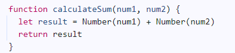

1. The program was concatenating the two inputs instead of adding it together. It concatenates because Javascript interprets the input as a string instead of a number.
2. Cast the two inputs as numbers. 